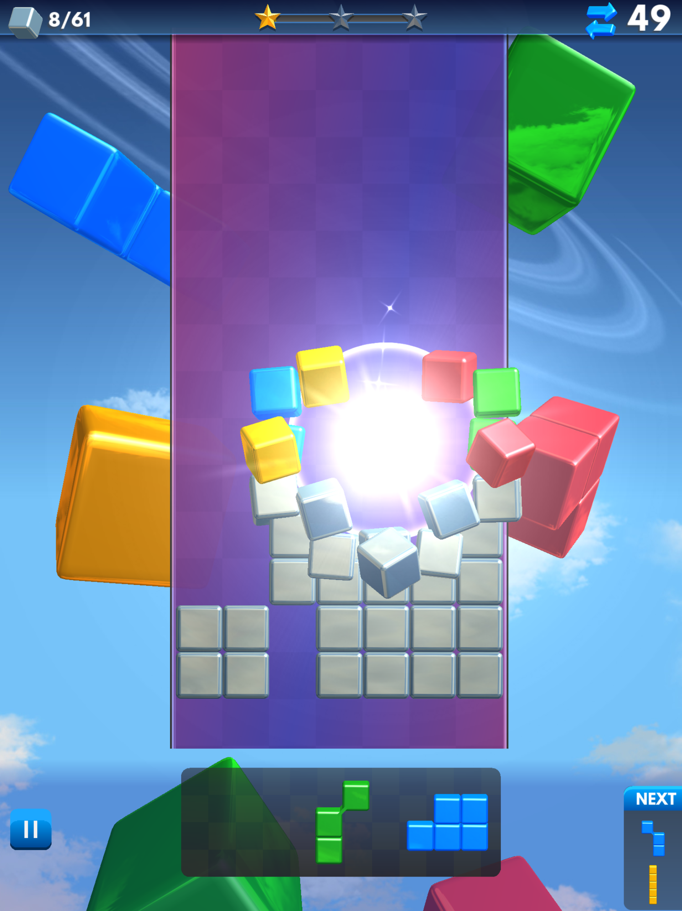
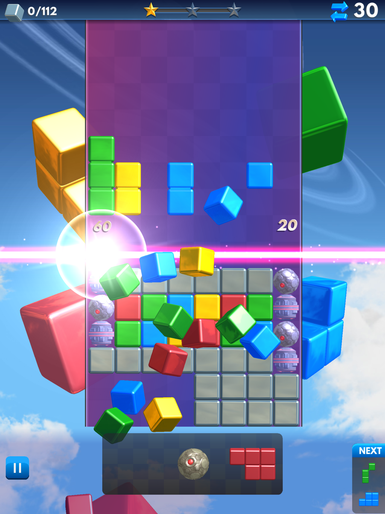
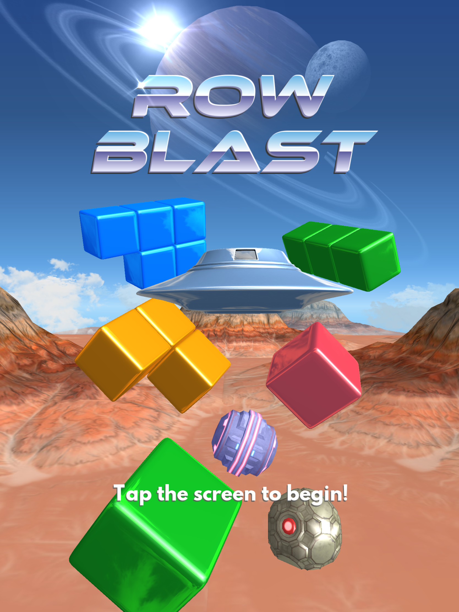
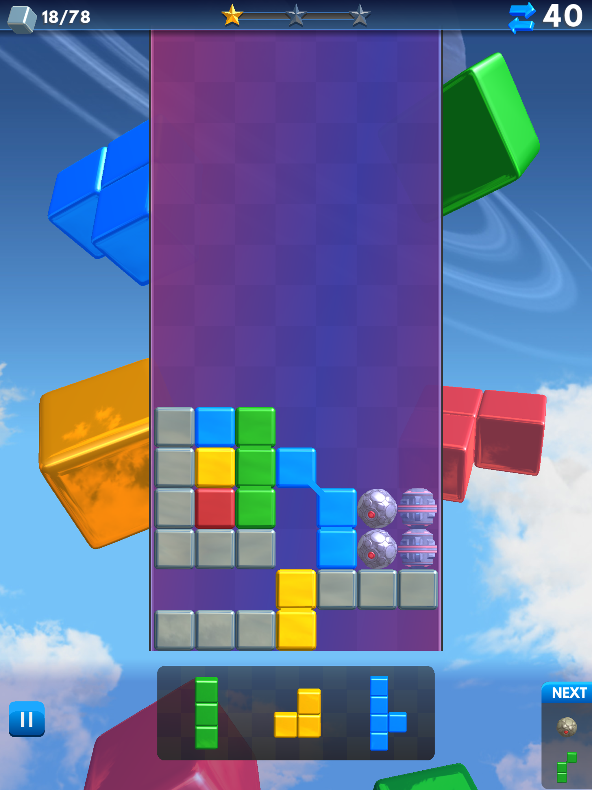
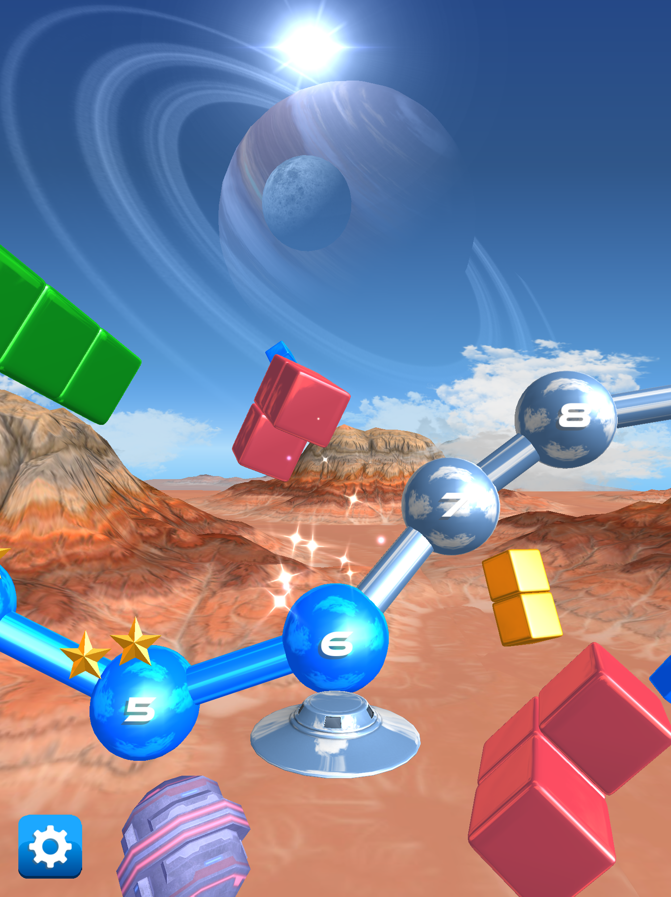
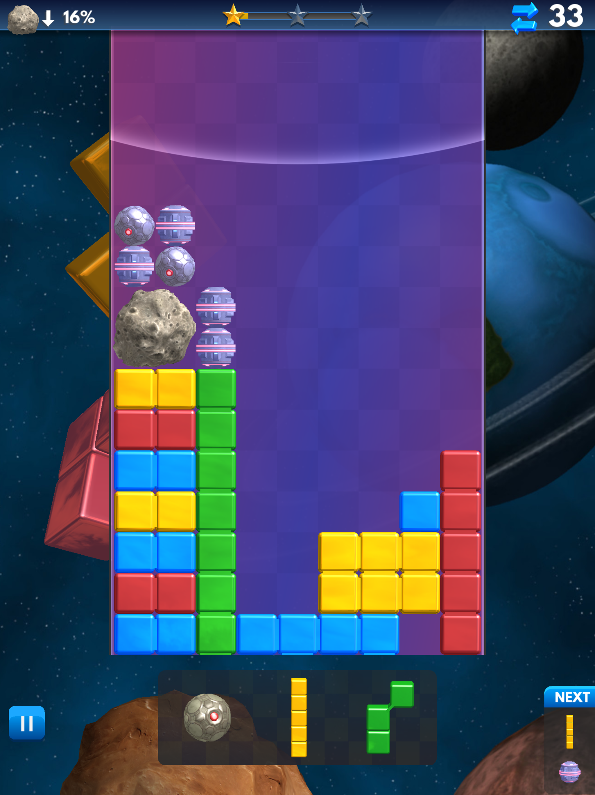

# PhotonBeam
PhotonBeam is a game engine used for creating games in the C++ language.
The only supported target platform is currently iOS.

## Features
* Scene graph (3D, cameras, lights, layers).
* Renderer (multiple render passes, environment mapping, per-pixel lighting, materials, batching, render state minimization, texture atlas, OpenGL ES).
* Animation system (multiple animation tracks, keyframes).
* Particle system.
* Touch input.
* GUI framework (views, buttons, scroll panels, fonts).
* Audio system for sound effects and music (OpenAL).

## Screenshots
These screenshots are from the game called Row Blast that I have created using the PhotonBeam engine.

